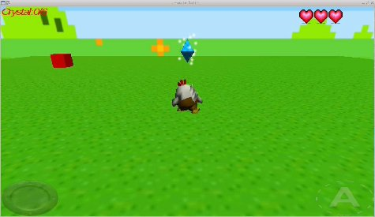

**Lunaria — Translation layer for iOS/Android** 🎮🐧

**Run Android ARM/x86_64 JNI libraries (especially Unity's `libunity.so`) on Linux** using **dynarmic JIT** emulation! 🚀

[](https://github.com/sponsors/yui0)

---

### ✨ Features
- **Full ARM32 emulation** with dynarmic JIT
- **Unity & Mono** game support (tested with Unity 4.x/5.x)
- **Cooperative threading** (guest threads run smoothly)
- **AssetManager bridge** — reads assets directly from APK
- **OpenGL/ES + EGL** passthrough to host
- **Headless support** via Xvfb
- **Memory-efficient** flat 4GB guest address space

### 🛠️ Build Instructions

```bash
make dynarmic-build     # Build dynarmic A32 JIT (requires cmake, libboost-dev)
make                    # Build Lunaria + runtime/*.so
```

```bash
make fetch-libunity     # Download test APK and extract ARM libs
make fetch-btw
```

**Required packages (Ubuntu/Debian):**
```bash
sudo apt install libglfw3-dev libegl1-mesa-dev libgles2-mesa-dev \
                 libbsd-dev libunwind-dev libboost-dev zlib1g-dev
```

### 🚀 How to Run

```bash
make test

# Run with APK (recommended)
bash lunaria-apk.sh UnitySampleGame.apk
bash lunaria-apk.sh test/dfu-mono-32bit.apk
bash lunaria-apk.sh test/btw-android.apk

# Direct library run
# LD_LIBRARY_PATH=.:runtime ANDROID_PACKAGE_CODE_PATH=$PWD/test/dfu-mono-32bit.apk ./lunaria test/libunity.so
```

**Headless mode:**
```bash
Xvfb :99 & DISPLAY=:99 ./lunaria ...
```

### ⚙️ Environment Variables

| Variable                    | Default     | Description |
|----------------------------|-------------|-----------|
| `LUNARIA_CALL_TICKS`       | 2G          | Tick limit per JNI call |
| `LUNARIA_ONLOAD_TICKS`     | 5G          | Tick limit for `JNI_OnLoad` |
| `LUNARIA_THREAD_TICKS`     | 200M        | Tick slice per guest thread |
| `LUNARIA_TRACE_SVC`        | off         | Log SVC calls (first 1000) |
| `LUNARIA_TRACE_BLOCKS`     | 0           | Log JIT block execution |
| `LUNARIA_DUMP_LAST_SVC`    | off         | Dump last 64 SVCs on exit |
| `LUNARIA_TRACE_FUTEX`      | off         | Log futex wait/wake |
| `LUNARIA_TRACE_JITINIT`    | off         | Trace `mono_jit_init_version` |
| `GC_DONT_GC`               | 1           | Disable Boehm GC (set by loader) |

**Tip:** You can use `K`/`M`/`G` suffixes: `LUNARIA_ONLOAD_TICKS=5G`

### 🏗️ Architecture Overview

- **Flat 4GB Memory** — Entire guest 32-bit address space is one big `mmap` (with fastmem)
- **SVC Trampolines** — All native calls (`libc`, `EGL`, `GLES2`, `JNI`, etc.) are routed through `SVC #n`
- **Cooperative Threads** — Guest `pthread_create` runs on auxiliary JIT with round-robin scheduling
- **Relocations** — Full support for `R_ARM_RELATIVE`, cross-library symbols, non-zero base
- **Asset Bridge** — `getAssets().open()` reads directly from APK (DEFLATE + STORE)
- **Safety Guards** — Prevents wild jumps, infinite JIT growth, and memory corruption

### 📁 Project Structure (Key Files)

- `arm_exec.cpp` — Core ARM emulation engine
- `lunaria-apk.sh` — APK launcher script
- `runtime/` — Host-side shared libraries
- `test/` — Sample APKs and libraries
- `jvm/` — JNI/JVM bridge

### 🎯 Supported Games / Use Cases

- Unity 4.x / 5.x games (Mono + IL2CPP)
- Android ARM32 libraries on Linux x86_64
- Headless server execution
- Game modding & reverse engineering

### 🎯 Screenshots



### 🔧 Troubleshooting

- **Black screen?** Try `LUNARIA_TRACE_EXC=1` or `LUNARIA_TRACE_MONO=1`
- **Slow?** Increase tick limits or check GPU passthrough
- **Crashes?** Enable `LUNARIA_DUMP_LAST_SVC=1` and report the log

**Made with ❤️ for the retro Android gaming & emulation community**

Enjoy running your favorite Android Unity games natively on Linux! 🎉

---

*Project Lunaria © 2026 Yuichiro Nakada*
